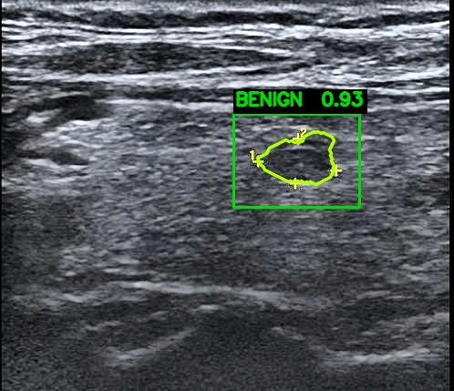
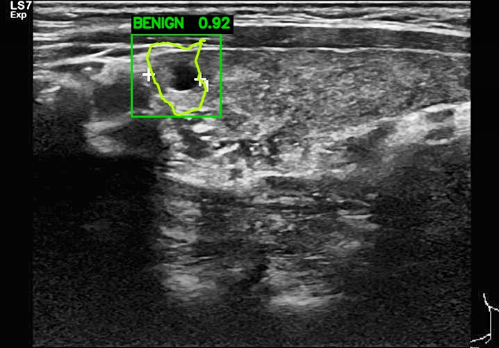
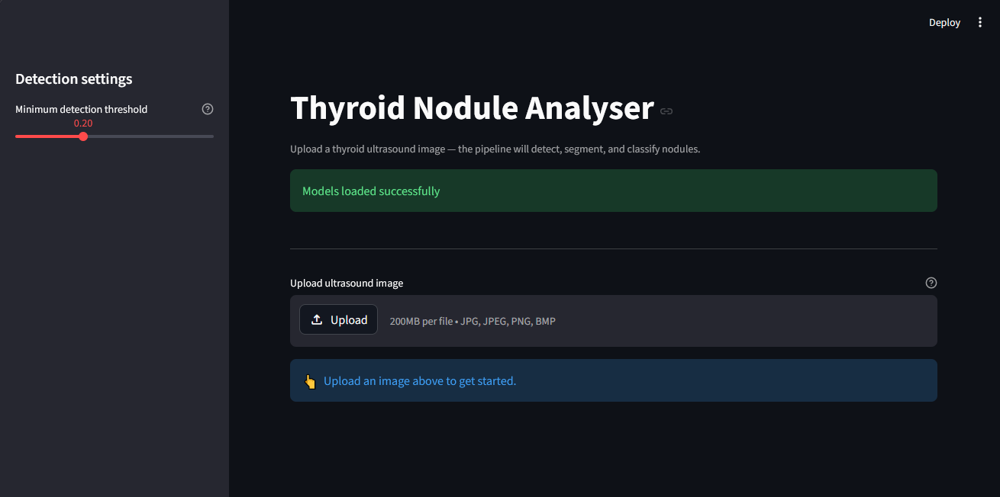
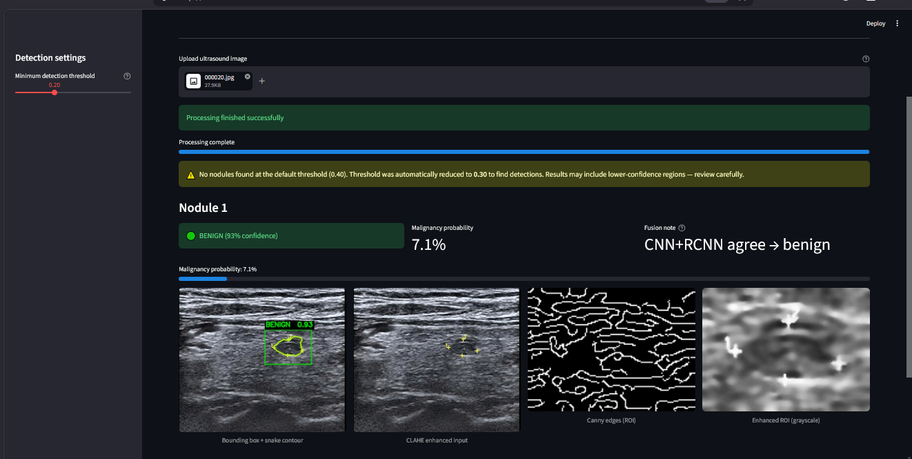
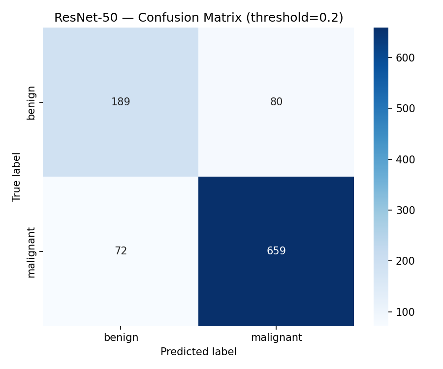
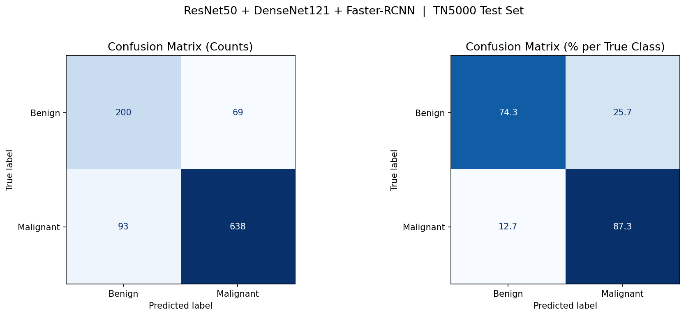

# Thyroid Nodule Detection & Classification

A deep learning pipeline for detecting, segmenting, and classifying thyroid nodules in ultrasound images. The system combines **Faster R-CNN** for nodule detection, a **DenseNet-121 + ResNet-50 ensemble** for malignancy classification, and a **Greedy Snake (Active Contour)** algorithm for precise nodule boundary delineation — all served through a **Streamlit** web interface.

**And Also Compare the results of Densenet-121, Resnet-50 and the ensembled system is one of the main objective of this project.**

---

## Table of Contents

- [Project Overview](#project-overview)
- [Models Used](#models-used)
  - [Faster R-CNN (Detection)](#1-faster-r-cnn-with-resnet-50-fpn-v2--nodule-detection)
  - [DenseNet-121 (Classification)](#2-densenet-121--classification)
  - [ResNet-50 (Classification)](#3-resnet-50--classification)
  - [Greedy Snake (Boundary Detection)](#4-greedy-snake-active-contour--boundary-delineation)
  - [Ensemble Fusion](#5-ensemble-fusion-strategy)
- [Model Performance](#model-performance)
- [Full Pipeline](#full-pipeline)
- [Preprocessing](#preprocessing)
- [Thresholding Strategy](#thresholding-strategy)
- [Project Structure](#project-structure)
- [Installation & Setup](#installation--setup)
- [Running the App](#running-the-app)
- [Dataset](#dataset)

---

## Project Overview

Thyroid nodule analysis in ultrasound imaging is challenging due to high speckle noise, low contrast between nodule and surrounding tissue, and significant variation in nodule size, shape, and echogenicity. This pipeline addresses those challenges using a multi-stage deep learning approach:

1. **Detect** nodule regions using Faster R-CNN
2. **Crop** each detected region with a context margin
3. **Classify** each crop as benign or malignant using an ensemble of DenseNet-121 and ResNet-50
4. **Compare** the results of resnet, Densenet and ensemble separately
5. **Fuse** the CNN classification with the RCNN's own label prediction
6. **Delineate** the nodule boundary using a Greedy Snake active contour
7. **Display** all results in a Streamlit web UI with annotated images and confidence scores

---

## Models Used

### 1. Faster R-CNN with ResNet-50 FPN v2 — Nodule Detection

**Architecture:** `fasterrcnn_resnet50_fpn_v2` (PyTorch torchvision)

**Why Faster R-CNN instead of YOLO or SSD?**

The choice was deliberate and educational — learning the two-stage detection paradigm rather than using a one-stage detector like YOLO. Faster R-CNN was chosen because:

- **Two-stage detection is more precise for small and subtle objects.** Thyroid nodules in ultrasound often have low contrast and ill-defined margins. A Region Proposal Network (RPN) that first proposes candidate regions, followed by a classification and refinement head, gives more careful attention to each candidate than YOLO's single-pass grid approach.
- **Feature Pyramid Network (FPN)** extracts multi-scale feature maps, which is critical for thyroid imaging where nodule sizes vary dramatically across patients — from small sub-centimetre nodules to large masses.
- **v2 backbone** uses improved weight initialization and better training recipes compared to v1, giving a stronger pre-trained foundation for fine-tuning.

**Architecture details:**

```
Input Image
    │
    ▼
ResNet-50 Backbone (shared feature extractor)
    │
    ▼
Feature Pyramid Network (FPN) — 5 scale levels
    │
    ▼
Region Proposal Network (RPN) — generates candidate bounding boxes
    │
    ▼
RoI Align — crops + resizes candidate regions
    │
    ▼
Classification Head → [background, benign, malignant]
Regression Head    → refined bounding box coordinates
```

**Classes:** 3 — background (0), benign (1), malignant (2)

**Key training decisions:**

| Parameter | Value | Reason |
|-----------|-------|--------|
| Optimizer | SGD with momentum | Standard for detection fine-tuning; more stable than Adam on RCNN |
| Learning rate schedule | Step decay | Prevents overshooting after initial convergence |
| Input | Full ultrasound image (not cropped) | RCNN needs full-image context for region proposals |
| NMS IoU threshold | 0.3 | Suppresses overlapping boxes; low value because nodules rarely overlap |

---

### 2. DenseNet-121 — Classification

**Architecture:** `densenet121` with custom classifier head

```python
model.classifier = nn.Sequential(
    nn.Dropout(p=0.5),
    nn.Linear(1024, 2)       # 1024 = DenseNet-121 output features
)
```

**Why DenseNet-121?**

DenseNet (Densely Connected Convolutional Network) is widely used in medical imaging because every layer receives feature maps from **all preceding layers**, not just the previous one. This means:

- Low-level texture features (speckle patterns, echogenicity gradients) are never lost — they pass directly to later layers
- The network is more parameter-efficient, which matters with limited medical datasets
- It is well-validated in radiology and pathology tasks

DenseNet-121 was the first classifier tried in this project. It achieved reasonable accuracy but not high enough for clinical confidence on its own, which motivated adding ResNet-50 and combining them.

**Training setup:**

| Parameter | Value |
|-----------|-------|
| Input size | 224 × 224 |
| Optimizer | Adam |
| Weight decay | 1e-4 (L2 regularisation) |
| Dropout | 0.5 (in classifier head) |
| Cross-validation | 3-Fold Stratified K-Fold |
| Data augmentation | Horizontal flip, rotation ±15°, colour jitter |
| Class imbalance | Weighted loss (inverse class frequency) |
| Normalization | ImageNet mean/std |

**Augmentation rationale:** Ultrasound images can be captured from various probe angles, so horizontal flip and rotation simulate real-world scan variation. Colour jitter simulates differences in machine settings and gain.

---

### 3. ResNet-50 — Classification

**Architecture:** `resnet50` with custom fully-connected head

```python
model.fc = nn.Sequential(
    nn.Linear(2048, 512),
    nn.ReLU(inplace=True),
    nn.Dropout(p=0.3),
    nn.Linear(512, 2)
)
```

**Why ResNet-50?**

ResNet uses **skip connections** (residual connections) that allow gradients to flow directly from later to earlier layers, solving the vanishing gradient problem. Where DenseNet passes features from every layer forward, ResNet passes the *identity* of the input forward — letting the network learn residual corrections rather than full transformations.

After DenseNet-121 alone didn't hit target accuracy, ResNet-50 was trained independently. Its performance was also good but similarly limited. The key insight was that the two models make **different types of errors** — DenseNet-121 better captures dense texture patterns while ResNet-50 better captures structural/shape features. Combining them into an ensemble smoothed out each model's weaknesses.

**Differences from DenseNet training:**

| Parameter | Value | Note |
|-----------|-------|------|
| LR | 3e-4 | Slightly lower for ResNet fine-tuning stability |
| Patience | 10 epochs | Increased from 5 to give more room to recover from plateaus |
| Dropout | 0.3 (lower) | ResNet already has regularisation via skip connections |
| Augmentation | Heavier — vertical flip, affine, Gaussian blur, random erasing | ResNet benefits from more aggressive augmentation |
| TTA at inference | 5-Crop Test-Time Augmentation | Averages predictions over 5 crops to reduce spatial bias |
| Pre-training | `ResNet50_Weights.IMAGENET1K_V2` | V2 weights give better transfer learning starting point |

**Test-Time Augmentation (TTA):** At inference, each nodule crop is passed through a `FiveCrop` transform (4 corners + centre), classified by each ResNet fold, and the 5 predictions are averaged. This reduces variance from the classifier's spatial sensitivity.

---

### 4. Greedy Snake (Active Contour) — Boundary Delineation

**Why not watershed or U-Net?**

Two reasons drove this choice:

1. **No segmentation masks in the dataset.** The dataset only contains bounding box annotations. Training a U-Net or Mask R-CNN would require pixel-level ground truth labels that don't exist here. The Greedy Snake works purely from the detected bounding box and the image gradient — no extra annotation needed.

2. **Personal interest in classical image processing.** Active contours represent a foundational technique in medical image analysis, and the Greedy Snake approach was chosen specifically for its ability to overcome **ultrasound speckle noise** — a major challenge for boundary detection in this modality.

**Why Greedy Snake over other active contours (e.g., GVF snake)?**

The Greedy algorithm iteratively moves each contour point to the neighbour position that minimises a combined energy function, rather than solving a global matrix equation. This makes it:

- More resistant to getting trapped in local noise spikes (speckle)
- Easier to tune on a per-image basis via `alpha`, `beta`, `gamma`
- Computationally straightforward without requiring eigenvalue decomposition

**Energy function:**

```
E_total(i) = α · E_elastic(i) / max_elastic
           + β · E_curvature(i) / max_curvature
           - γ · E_image(i)
```

| Term | Symbol | Role |
|------|--------|------|
| Elastic energy | α = 0.5 | Keeps contour points evenly spaced — prevents bunching |
| Curvature energy | β = 0.2 | Keeps the contour smooth — resists sharp kinks |
| Image (external) energy | γ = 2.0 | Attracts points to strong edges (Sobel gradient magnitude) |

**Pre-processing before snake:**

Before running the snake, the ROI is enhanced specifically for ultrasound:

1. **Bilateral filter** — smooths speckle noise while preserving the nodule boundary edge
2. **CLAHE** — enhances local contrast so the boundary gradient is stronger
3. **Median blur** — final pass to remove remaining salt-and-pepper noise
4. **Canny edge detection** — produces the edge map visualised in the UI (low: 30, high: 80)

**Initialisation:** The snake starts as an ellipse inscribed in the bounding box (90% of box size, 120 contour points), then iteratively deforms toward the true nodule boundary over 300 iterations with a search radius of 3 pixels.

---

### 5. Ensemble Fusion Strategy

At classification time, **6 models vote** on each nodule crop:

- 3 × DenseNet-121 (one per K-fold) — standard single-pass inference
- 3 × ResNet-50 (one per K-fold) — 5-crop TTA, then averaged

Their softmax probability vectors are averaged into a single `[P_benign, P_malignant]` vector.

**Final label fusion (CNN + RCNN):**

The CNN ensemble's prediction is then reconciled with the Faster R-CNN's own label:

```
if CNN_label == RCNN_label:
    → Use CNN label  (both agree)

elif 0.35 ≤ mal_prob ≤ 0.50:
    → Use RCNN label  (CNN is in the uncertain zone, defer to detector)

else:
    → Use CNN label  (CNN is confident, override RCNN)
```

This three-way logic means the RCNN's classification is only used as a tiebreaker when the ensemble is uncertain (malignancy probability in the 35–50% range). Outside that range the ensemble's confidence is trusted.

**Malignancy threshold:** `MALIGNANT_THRESH = 0.32` (below 0.5). This is intentionally lower than 0.5 because **false negatives (missing a malignant nodule) are clinically more dangerous than false positives**. Lowering the threshold biases the system toward flagging suspicious cases for review.

---

## Model Performance

### Faster R-CNN

The detection model was trained for 10 epochs. Training loss decreased steadily from ~0.155 to ~0.074, while validation loss plateaued around 0.11 — indicating good generalisation without significant overfitting.


**Learning curve analysis:**

| Epoch | Train Loss | Val Loss |
|-------|-----------|---------|
| 1 | ~0.155 | ~0.134 |
| 2 | ~0.121 | ~0.124 |
| 3 | ~0.106 | ~0.123 |
| 4 | ~0.098 | ~0.113 |
| 5 | ~0.088 | ~0.113 |
| 6 | ~0.105 | ~0.115 |
| 7 | ~0.099 | ~0.123 |
| 8 | ~0.093 | ~0.116 |
| 9 | ~0.082 | ~0.114 |
| 10 | ~0.074 | ~0.110 |

- Training loss fell consistently across all 10 epochs (0.155 → 0.074, ~52% reduction).
- Validation loss dropped sharply in the first 4 epochs then plateaued in the 0.110–0.124 range, with a minor spike at epoch 7 before recovering.
- The ~0.036 train/val gap at epoch 10 is modest for a two-stage detector fine-tuned on a moderate-sized medical dataset, and does not indicate problematic overfitting.
- The slight uptick in train loss at epoch 6 is characteristic of SGD with step-decay learning rate schedules (momentary instability at the LR step boundary).

-Print some output images for comparison


---
### DenseNet-121

| Metric | Value |
|--------|-------|
| Overall Accuracy | **87%** |
| Malignant Precision | 89% |
| Malignant Recall | 94% |
| Malignant F1 | 0.91 |
| Benign Precision | 81% |
| Benign Recall | 68% |
| Macro F1 | 0.8253 |
| ROC-AUC | **0.9137** |

Test set confusion matrix (1000 samples — 269 benign, 731 malignant):

|  | Predicted Benign | Predicted Malignant |
|--|-----------------|---------------------|
| **True Benign** | 182 | 87 |
| **True Malignant** | 43 | 688 |

DenseNet achieves high malignant recall (94%) which is the most clinically important metric — it misses only 43 malignant cases out of 731.


The learning curves show a consistent train/val gap across all 3 folds — characteristic of DenseNet's tendency to overfit slightly on smaller datasets, which is why dropout (p=0.5) was used in the classifier head.

**Learning curve analysis (3-Fold K-Fold):**

| Fold | Train Loss (ep 20) | Val Loss (ep 20) | Train Acc (ep 20) | Val Acc (ep 20) |
|------|--------------------|------------------|-------------------|-----------------|
| 1 | ~0.26 | ~0.47 | ~0.94 | ~0.85 |
| 2 | ~0.25 | ~0.50 | ~0.95 | ~0.84 |
| 3 | ~0.25 | ~0.50 | ~0.94 | ~0.83 |

- Across all 3 folds, training loss decreases smoothly and continuously from ~0.57–0.60 to ~0.25–0.26, while validation loss quickly drops in the first 3 epochs and then **plateaus** in the 0.45–0.50 range for the remainder of training. This plateau, combined with the growing train/val gap, is the primary sign of moderate overfitting.
- Training accuracy climbs steadily to ~94–95% by epoch 20, while validation accuracy stabilises around 83–85% — a consistent ~10% generalisation gap across all folds.
- The validation loss plateau is stable (no sustained divergence), meaning the model is not catastrophically overfitting — the dropout (p=0.5) and weighted loss are containing it. However, the gap indicates the model has memorised some training-specific texture patterns that do not transfer perfectly to unseen ultrasound images.
- Fold 3 shows a notable validation loss spike around epoch 16 (~0.58), likely from a difficult mini-batch. It recovers immediately, suggesting this is noise rather than a training instability.
- The curves are reproducible across folds (all 3 show near-identical shape), which validates that the train/val gap reflects the model's structural behaviour rather than a lucky or unlucky data split.

-Print some output images for comparison


---
### ResNet-50

Evaluated at threshold = 0.3 (lower than default 0.5 to improve malignant sensitivity):

Test set confusion matrix (1000 samples):

|  | Predicted Benign | Predicted Malignant |
|--|-----------------|---------------------|
| **True Benign** | 205 | 64 |
| **True Malignant** | 97 | 634 |

ResNet-50 at threshold 0.3 correctly identifies 634/731 malignant cases (86.7% recall). The tighter train/val accuracy curves across all 3 folds compared to DenseNet suggest ResNet generalises more uniformly — confirming that the two models have complementary error patterns, which is what makes the ensemble effective.


**Learning curve analysis (3-Fold K-Fold):**

| Fold | Best Epoch | Train Loss (best ep) | Val Loss (best ep) | Train Acc (best ep) | Val Acc (best ep) |
|------|-----------|---------------------|-------------------|--------------------|--------------------|
| 1 | 13 | ~0.36 | ~0.43 | ~0.78 | ~0.80 |
| 2 | 18 | ~0.35 | ~0.36 | ~0.80 | ~0.81 |
| 3 | 19 | ~0.35 | ~0.37 | ~0.79 | ~0.82 |

- ResNet-50's most notable characteristic compared to DenseNet is that **validation accuracy equals or exceeds training accuracy** in all 3 folds throughout much of training. This is atypical and indicates the weighted sampler and heavy augmentation are causing the training set to be harder than the validation set during training — the model effectively sees a harder distribution at train time, which boosts val performance.
- Validation loss is noisier than training loss across all folds, with frequent oscillations (most visible in Fold 1, where val loss fluctuates between ~0.36 and ~0.44 after epoch 10). This is expected with a smaller validation set and weighted sampling.
- Training loss decreases steadily from ~0.54–0.56 down to ~0.34–0.35 across all folds, with no sign of instability — confirming that the Adam optimiser with LR=3e-4 and the extended patience=10 setting allows stable convergence.
- Best checkpoints are saved late (epochs 13, 18, 19), meaning the model continues to improve well into training and does not plateau early. This validates the increased patience setting (10 epochs) compared to DenseNet's 5.
- The train/val accuracy gap in ResNet is much smaller than in DenseNet (~1–3% vs ~10%), confirming that ResNet-50 generalises more uniformly — likely due to the heavier augmentation (vertical flip, affine, Gaussian blur, random erasing) and TTA at inference time.

-Print some output images for comparison


---

## Full Pipeline

```
┌─────────────────────────────────────────────────────────┐
│                    INPUT: Ultrasound Image               │
└────────────────────────┬────────────────────────────────┘
                         │
                         ▼
┌─────────────────────────────────────────────────────────┐
│              PREPROCESSING (apply_clahe)                 │
│  1. Convert BGR → LAB colour space                      │
│  2. CLAHE on L channel (clipLimit=2.0, grid=8×8)        │
│  3. Convert LAB → BGR                                   │
│  4. Unsharp mask: weight 1.3×sharp − 0.3×blurred        │
└────────────────────────┬────────────────────────────────┘
                         │
                         ▼
┌─────────────────────────────────────────────────────────┐
│         DETECTION: Faster R-CNN (detect_nodules)         │
│  • Start at score threshold = 0.40                      │
│  • If no detections → lower by 0.05, retry              │
│  • Stop at user-defined minimum (default 0.20)           │
│  • Returns: boxes, labels, scores, threshold used        │
└────────────────────────┬────────────────────────────────┘
                         │
                         ▼
┌─────────────────────────────────────────────────────────┐
│         NMS: Non-Maximum Suppression (apply_nodule_nms)  │
│  • Sort boxes by score (descending)                     │
│  • Suppress boxes with IoU ≥ 0.30 with a kept box       │
└────────────────────────┬────────────────────────────────┘
                         │
              ┌──────────┴──────────┐
              │  For each nodule    │
              ▼                    ▼
┌──────────────────────┐  ┌────────────────────────────────┐
│  CROP (crop_nodule)  │  │  CONTOUR (extract_nodule_      │
│  • Add 30px margin   │  │  contour)                      │
│  • Clip to image     │  │  1. Bilateral filter (d=9)     │
│  bounds              │  │  2. CLAHE                      │
└──────────┬───────────┘  │  3. Median blur (k=3)          │
           │              │  4. Canny edges (30, 80)        │
           ▼              │  5. Init ellipse (120 pts, 90%) │
┌──────────────────────┐  │  6. Greedy Snake (300 iters)   │
│  CLASSIFY            │  └────────────────┬───────────────┘
│  (classify_crop)     │                   │
│                      │                   │
│  DenseNet-121 ×3     │         contour coordinates
│  (val_transform,     │         in global image space
│  single pass)        │
│         +            │
│  ResNet-50 ×3        │
│  (TTA: 5-crop,       │
│  averaged)           │
│         ↓            │
│  Average 6 softmax   │
│  vectors             │
│         ↓            │
│  mal_prob ≥ 0.32     │
│  → "malignant"       │
└──────────┬───────────┘
           │
           ▼
┌──────────────────────────────────────────────────────────┐
│           FUSION (fuse_predictions)                      │
│  CNN label + RCNN label → final_label                   │
│  • Agree → use CNN label                                 │
│  • 0.35 ≤ prob ≤ 0.50 → use RCNN label                  │
│  • CNN confident → use CNN label                         │
└──────────────────────────┬───────────────────────────────┘
                           │
                           ▼
┌──────────────────────────────────────────────────────────┐
│           OUTPUT (draw_results_with_contour)             │
│  • Bounding box drawn on full image                     │
│  • Snake contour overlaid (polylines)                   │
│  • Label + confidence annotated                         │
│  • Canny edge map shown per nodule                      │
│  • Enhanced grayscale ROI shown per nodule              │
└──────────────────────────────────────────────────────────┘
```

---

## Preprocessing

All three models share **identical preprocessing** to ensure the detector, DenseNet, and ResNet all see the same image representation.

### CLAHE (Contrast Limited Adaptive Histogram Equalisation)

Standard histogram equalisation applies globally across the image, which causes over-amplification of contrast in uniform regions (like the background gel in ultrasound). CLAHE divides the image into small tiles (8×8 grid) and equalises each tile independently, clipping the histogram at `clipLimit=2.0` to prevent noise amplification. The result is localised contrast enhancement that makes nodule boundaries more distinct without washing out the background.

Processing is done in **LAB colour space** rather than RGB because the L channel represents perceived luminance independently from colour — allowing contrast enhancement without shifting hue or saturation.

### Unsharp Masking

After CLAHE, a mild unsharp mask sharpens nodule margins:

```python
sharpened = 1.3 × CLAHE_image − 0.3 × GaussianBlur(CLAHE_image, σ=2)
```

This enhances high-frequency edge information (nodule boundary) while keeping the gain low enough (1.3/−0.3) not to amplify speckle noise.

---

## Thresholding Strategy

The pipeline uses several thresholds, each chosen for a specific clinical or technical reason.

### Detection Threshold — Adaptive (default: 0.40, minimum: 0.20)

The RCNN's confidence score threshold starts at **0.40** and steps down by 0.05 until at least one detection is found, stopping at the user-configured minimum.

**Why 0.40 as default?** A threshold of 0.5 (the conventional default) discards too many true nodules in low-contrast ultrasound images where the model's confidence is inherently lower. 0.40 was found empirically to give a good precision/recall balance on this dataset.

**Why adaptive?** Thyroid ultrasound quality varies by machine, patient anatomy, and operator skill. A fixed threshold that works for a clear image will miss nodules in a lower-quality scan. The adaptive approach allows the system to remain sensitive while not flooding clear images with false positives.

### NMS IoU Threshold — 0.30

Non-Maximum Suppression removes duplicate detections. A threshold of **0.30** (rather than the conventional 0.50) is used because thyroid nodules are spatially separated — two boxes with 30% overlap are almost certainly detecting the same nodule, not two adjacent ones.

### Malignancy Threshold — 0.32

The ensemble's averaged softmax probability is compared to **0.32** (not 0.50) to decide malignant vs benign.

**Why below 0.5?** In a medical screening context, missing a malignant nodule (false negative) is more harmful than over-flagging a benign one (false positive) — a false positive leads to additional imaging or biopsy, while a false negative can mean delayed treatment. Setting the threshold at 0.32 biases the system toward sensitivity (recall for malignant class) at the cost of some specificity. This matches the clinical philosophy of "flag and refer" rather than "diagnose and discharge."

### RCNN Override Zone — 0.35 to 0.50

When the ensemble's malignancy probability falls between 0.35 and 0.50, the CNN is considered uncertain and the RCNN's own class label is used instead. This range was chosen as the natural "uncertain" band around the malignancy threshold, where a second opinion from the detection head is most useful.

---
## Greedy Algorithm Edge Detection and segmantation Output
- To draw a line around the nodule, i used classical image processing technique called Greedy algorithm (Active curves)
- Print Some outputs
  




## App Outputs
- Print some outputs
-Interface 


-Interface with output



---
## Model Output Comparison

-Densnet with 0.35 threshold


-Resnet with 0.2 threshold


-Ensemble with 0.28 threshold


**Even though we use ensemble in the project the densenet in much effective even though it tends to overfit**

---

## Project Structure

```
thyroid-nodule-detection/
│
├── app.py                          # Streamlit web interface
├── pipeline.py                     # All model + processing logic
│
├── Data/
│   └── Have some ultrasound images
│   
├── DenseNet-121 Model data/                        
│   ├── confusion matrices
│   ├── Model weights Drive link.md
│   ├── __notebook_source__.ipynb
│   ├── cnn-for-thyroisd.ipynb
│   ├── densenet_gt_vs_pred.png
│   └── densenet_learning_curves.png
├── ResNet-50 model data/                        
│   ├── confusion matrices
│   ├── Model weights Drive link.md
│   ├── __notebook_source__.ipynb
│   ├── cnn-with-resnet-for-thyroid-classification.ipynb
│   ├── resnet_gt_vs_pred.png
│   └── resnet_learning_curves.png
├── RCNN Model Data/                        
│   ├── Images
│   ├── Model weight Drive link.md
│   ├── Predictions.png
│   ├── Training curve_2.png
│   ├── __notebook_source__.ipynb
│   ├── classify-thyroid-nodules.ipynb
│   ├── comparison.png
│   └──training curve.png
├── Final Pipelines/                        
│   ├── Combined pipeline.ipynb
│   ├── Final pipeline(denseNet).ipynb
│   └── combined_pipeline_with_contour.ipynb
└── README.md  
```

---

## Installation & Setup

### 1. Clone the repository

```bash
git clone https://github.com/<your-username>/thyroid-nodule-detection.git
cd thyroid-nodule-detection
```

### 2. Create a virtual environment

```bash
python -m venv venv

# Windows
venv\Scripts\activate

# macOS / Linux
source venv/bin/activate
```

### 3. Install dependencies

```bash
pip install -r requirements.txt
```

**requirements.txt:**

```
torch>=2.0.0
torchvision>=0.15.0
streamlit>=1.32.0
opencv-python>=4.8.0
numpy>=1.24.0
Pillow>=10.0.0
```

> **GPU:** If you have a CUDA-capable GPU, install the matching torch+cuda wheel from [pytorch.org](https://pytorch.org/get-started/locally/) for significantly faster inference.

### 4. Download model weights

The trained weights are not stored in this repository due to file size. Download them from the given google drive folders or use your own training outputs, then update the paths in `pipeline.py`:

```python
RCNN_WEIGHTS_PATH       = "path/to/best_fasterrcnn.pth"
DENSENET_WEIGHTS_PATHS  = [
    "path/to/best_densenet_fold1.pth",
    "path/to/best_densenet_fold2.pth",
    "path/to/best_densenet_fold3.pth",
]
RESNET_WEIGHTS_PATHS    = [
    "path/to/best_resnet50_fold1.pth",
    "path/to/best_resnet50_fold2.pth",
    "path/to/best_resnet50_fold3.pth",
]
```

---

## Running the App

```bash
streamlit run app.py
```

The app will open in your browser at `http://localhost:8501`.

### How to use

1. **Upload** a thyroid ultrasound image (JPG, PNG, or BMP) using the file uploader.
2. Optionally adjust the **Minimum detection threshold** slider in the sidebar (lower = more sensitive, more false positives possible).
3. The pipeline runs automatically and displays:
   - A detection confidence warning if the threshold was reduced adaptively
   - Per-nodule panels: annotated image, CLAHE-enhanced input, Canny edge map, enhanced ROI
   - Classification badge (🔴 MALIGNANT / 🟢 BENIGN) with confidence percentage
   - Malignancy probability bar
   - Fusion note explaining how the final label was determined
4. Download the annotated result image using the **Download annotated image** button.

### What each panel shows

| Panel | Description |
|-------|-------------|
| Bounding box + snake contour | Full image with RCNN detection box and active contour boundary |
| CLAHE enhanced input | The preprocessed input image the models actually see |
| Canny edges (ROI) | Edge map used to guide the snake contour |
| Enhanced ROI (grayscale) | Bilateral-filtered + CLAHE enhanced nodule region |

---

## Dataset

**Source:** [Thyroid Ultrasound Dataset — Kaggle](https://www.kaggle.com/datasets/abdullahelafifi/main-data)

The dataset follows the Pascal VOC annotation format with XML bounding box annotations.

| Split | Samples |
|-------|---------|
| Train | Included in `train.txt` |
| Validation | Included in `val.txt` |
| Test | Included in `test.txt` |

Classes: `benign` (label 0), `malignant` (label 1)

The dataset has a class imbalance skewed toward malignant cases (~73% malignant in test set). This was handled through:

- **Weighted cross-entropy loss** (inverse class frequency weights)
- **WeightedRandomSampler** during training to oversample the minority class
- **Lowered malignancy threshold** (0.32) at inference to preserve sensitivity

---

## Notes for Viewers / Researchers

- All three models share identical preprocessing (CLAHE + unsharp mask, 224×224 resize, ImageNet normalisation) so no domain shift is introduced between detection and classification stages.
- The Greedy Snake is a **visualisation and interpretability tool**, not a classification input. The nodule boundary is drawn for the clinician/viewer — it does not feed back into the classification decision.
- 3-Fold Stratified K-Fold cross-validation was used instead of a simple train/val split because the dataset size is moderate — K-Fold gives a more reliable estimate of generalisation performance and produces 3 model checkpoints that naturally form the ensemble.
- The pipeline is fully CPU-compatible. On CPU, inference on a single image takes approximately 10–30 seconds depending on the number of detected nodules and the snake convergence speed.

---

*Built with PyTorch, torchvision, OpenCV, and Streamlit.*
